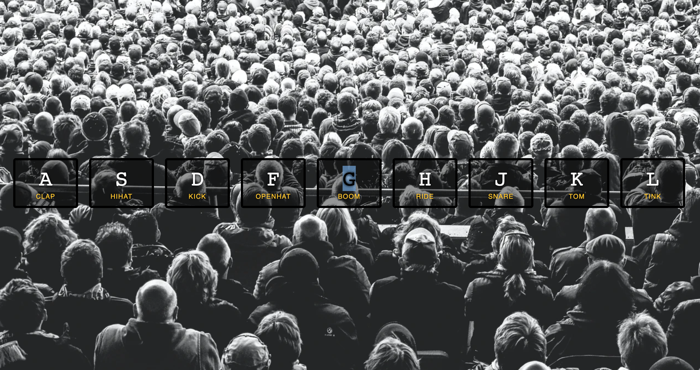

# JS Drumkit

Day 1 of JavaScript30. Made a site where you can control the Drumkit by pressing the correct key on your keyboard or by pressing the sound icons. Also there is a little animation when the icons are pressed.

# Demo

# Technologies Used

Vanilla JS, HTML5, CSS

# Website

https://buigabor.github.io/JS-drum-kit/
